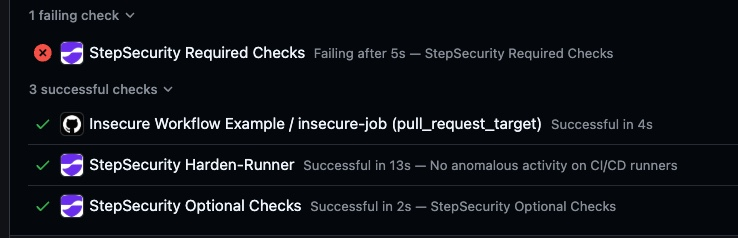

# GitHub Checks
 
GitHub checks allows you to enforce security controls by blocking Pull Requests that are failing specific controls (ie; compromised NPM packages or vulnerable workflows). For more information, see [here](https://docs.stepsecurity.io/github-checks). 

This Repository contains some basic workflows/files that will trigger StepSecurity GitHub Check failures. Feel free to add your own context for testing purposes as well. 

| Control | Description |
|------|-------------|
| **NPM Package Compromised Updates** | Blocks PR's attempting to merge known compromised NPM packages |
| **NPM Package Cooldown** | Blocks PR's attempting to merge a recently release version (cooldown period is configurable) |
| **PWN Request** | Blocks PR's containing insecure workflow configurations that allows exploitation through maliscious forked PR's  |
| **Script Injection** | Blocks PR's containing workflows that use overly permissive triggers or unsanitized external inputs |

## Prerequisites

1. Ensure you have installed the [Basic StepSecurity GitHub App](https://github.com/apps/stepsecurity-actions-security) and the [Advanced StepSecurity GitHub App](https://github.com/apps/stepsecurity-app), and have access to your StepSecurity dashboard
2. Fork/clone this repository into your own Organization, or use an existing repository within your Organization
3. Policy Setup:
   * Create a GitHub Checks Policy for this repository in the StepSecurity Dashboard: **GitHub Checks → Configuration**
   * Ensure all 4 controls are enabled (you can choose **Optional checks** or **Required Checks**), and ensure that the selected checks type **is enabled for the repository you are testing**

## Testing Detections

This repository contains a branch [vuln-branch](https://github.com/step-security-poc/stepsecurity-poc-github-checks/tree/vuln-branch), which can be used to trigger the following detections upon opening a PR to merge: 
  
#### 1. NPM Package Compromised Updates
* Introduces a compromised NPM package into the package.json (ansi-regex 6.2.1). Feel free to add your own compromised NPM package for testing

#### 2. PWN Request
* Introduces a workflow using a risky trigger (pull_request_target) and does not checkout the code using an explicit ref

#### 3. Script Injection
* Introduces a workflow executing untrusted input from context variables (ie. github.event.pull_request.title)

**Alternatively, you can directly copy the following 3 scripts and introduce them as part of a PR into your exising repository: [pwn-request script](https://github.com/step-security-poc/stepsecurity-poc-github-checks/blob/vuln-branch/.github/workflows/pwn-request.yml), [script injection script](https://github.com/step-security-poc/stepsecurity-poc-github-checks/blob/vuln-branch/.github/workflows/script-injection.yml), package.json introducing [ansi-regex 6.2.1](https://github.com/step-security-poc/stepsecurity-poc-github-checks/blob/vuln-branch/package.json)**

*Note: By default, you will be able to merge failed checks unless you have explicitly defined a branch protection rule to require a pass in order to merge*

#### (Test coming soon for NPM Cooldown Check - feel free to introduce a recently released package to test this)

### Once you have set up GitHub Checks Policy, any pull request opened will now undergo StepSecurity Checks, per the policy that has been set above. You can view results and context directly within the PR, or centrally within the StepSecurity Dashboard

